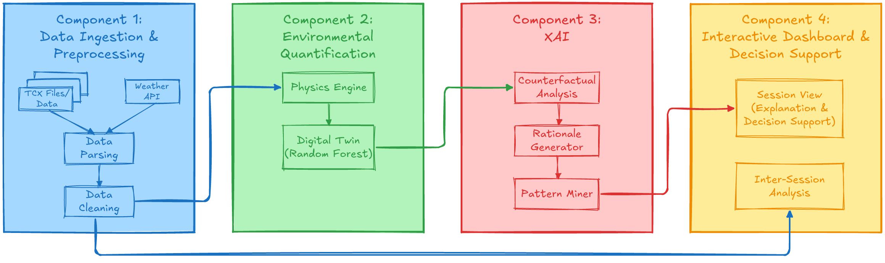

# 🚴‍♂️ PACE-VIEW: Explainable Cycling Intelligence Dashboard

PACE-VIEW turns raw TCX rides into decision-ready insights for athletes and coaches.  
It combines physics-informed modeling, digital-twin prediction, and explainable AI in one interactive dashboard.

### 💪 Why PACE-VIEW?
- **Dashboard-first workflow**: inspect workload, HR zone mix, efficiency trends, and per-session explanations in one place.
- **Explainability by design**: use counterfactual analysis, rationale generation, and pattern mining to understand *why* a session felt hard or easy.
- **Physics + ML pipeline**: quantify wind/terrain/environmental load and compare expected vs observed physiology.
- **Modular architecture**: run the full web app or use components independently in scripts.

### ↗️ Quick start
Run the full dashboard:

```
python examples/full_dashboard.py
```

Then open an activity to view detailed explanations and decision-support outputs.

- **Free software**: MIT license
- **Python versions**: 3.8.x, 3.9.x, 3.10.x, 3.11.x, 3.12.x
- **Documentation**: [https://pace-view.readthedocs.io/en/latest/](https://pace-view.readthedocs.io/en/latest/)
- **Tested** OS: Windows, Ubuntu, Fedora, Alpine, Arch, macOS. **However, that does not mean it does not work on others**

## 📦 Installation 
Install PACE-VIEW with pip:

```
pip install pace_view
```

In case you want to install directly from the source code, use:

```
git clone https://github.com/firefly-cpp/pace_view.git
cd pace_view
poetry build
python setup.py build
```

To install PACE-VIEW on Fedora Linux, please use:

```
dnf install python3-pace_view
```

To install PACE-VIEW on Alpine Linux, please use:

```
apk add py3-pace_view
```

To install PACE-VIEW on Arch Linux:

```
yay -Syyu python-pace_view
```

## ✨ Implemented Components


### Component 1: Data Ingestion & Preprocessing
This component loads raw activity and weather signals, aligns timestamps, and builds clean dataframes for downstream modeling.  
Classes/modules: `DataParser` ([pace_view/data_parsing.py](pace_view/data_parsing.py)), `DataCleaner` ([pace_view/data_cleaning.py](pace_view/data_cleaning.py)).

### Component 2: Environmental Quantification
This component quantifies external/mechanical load and learns expected physiological behavior from historical rides.  
Classes/modules: `PhysicsEngine` ([pace_view/physics.py](pace_view/physics.py)), `DigitalTwinModel` ([pace_view/digital_twin.py](pace_view/digital_twin.py)).

### Component 3: XAI
This component explains deviations with counterfactual reasoning, generates human-readable rationales, and mines global patterns.  
Classes/modules: `CounterfactualAnalyzer` ([pace_view/counterfactual.py](pace_view/counterfactual.py)), `RationaleGenerator` ([pace_view/rationale.py](pace_view/rationale.py)), `PatternMiner` ([pace_view/mining.py](pace_view/mining.py)).

### Component 4: Interactive Dashboard & Decision Support
This component exposes session-level explanation and inter-session analysis through the web UI and example views.  
Classes/modules: `ContextTrainer` ([pace_view/core.py](pace_view/core.py)) plus the Flask/Dash app in [examples/full_dashboard.py](examples/full_dashboard.py).

## 📓 Examples

Run these from the repository root:

1. `python examples/full_dashboard.py`  
   Runs the full interactive dashboard with all cards and activity detail routing. It is the end-to-end example that combines visualization and contextual explanations.

2. `python examples/activity_detail_page_example.py`  
   Serves only the activity detail page for a single example TCX activity. It demonstrates the detail view with ContextTrainer output but without the full dashboard.

3. `python examples/context_trainer_text_example.py`  
   Runs ContextTrainer without Flask or Dash and prints text-only results to the terminal. It demonstrates model fitting, pattern mining, and single-activity explanation in CLI form.

4. `python examples/hr_zone_mix_example.py`  
   Shows only the HR Zone Mix card with period controls. It demonstrates the zone-distribution visualization in isolation.

5. `python examples/efficiency_over_time_example.py`  
   Shows only the Efficiency Over Time card with rolling-window controls. It demonstrates how trend window changes affect the efficiency plot.

6. `python examples/hr_vs_speed_duration_example.py`  
   Shows only the HR vs Speed x Duration heatmap card. It demonstrates the binned relationship between duration, speed, and heart rate.

## Repository Structure

- `pace_view/` core pipeline modules
- `data/` sample TCX files for local testing
- `tests/` pytest unit tests
- `scripts/` local helpers and experiments
- `assets/` images and supporting artifacts

## Core Components

- `pace_view/data_parsing.py` loads TCX files and optional weather context
- `pace_view/data_cleaning.py` builds aligned dataframes
- `pace_view/physics.py` computes headwind, gradient, and virtual power
- `pace_view/digital_twin.py` predicts expected HR and drift
- `pace_view/counterfactual.py` and `pace_view/rationale.py` build explanations
- `pace_view/mining.py` mines interpretable rules using NiaARM

## Data Flow (high level)

1. Parse TCX -> activity arrays + weather
2. Clean + align -> dataframe
3. Physics features -> headwind, gradient, virtual power
4. Digital twin -> predicted HR and drift
5. Counterfactual + rationale -> explanation output
6. Pattern mining -> global rules across rides

## Testing

Run from repo root:

```
python -m pytest -q
```

If you use a specific interpreter:

```
<path/to/your/python/>python.exe -m pytest -q
```

## Configuration (Weather API)

If you want weather enrichment, provide an API key via environment variables:

```
WEATHER_API_KEY=<your_key_here>
```

Examples using `ContextTrainer` now resolve the key centrally via `pace_view.config.get_weather_api_key()`.
It checks the process environment first and also loads a project-root `.env` file if present.

Optional manual loading with `python-dotenv`:

```
from dotenv import load_dotenv
import os
load_dotenv()
api_key = os.getenv("WEATHER_API_KEY")
```

## 🔑 License

This package is distributed under the MIT License. This license can be found online
at <http://www.opensource.org/licenses/MIT>.

## Disclaimer

This framework is provided as-is, and there are no guarantees that it fits your purposes or that it is bug-free. Use it at your own risk!

## 📖 Further read
[1] [Awesome Computational Intelligence in Sports](https://github.com/firefly-cpp/awesome-computational-intelligence-in-sports)

## 🔗 Related packages/frameworks

[1] [sport-activities-features: A minimalistic toolbox for extracting features from sports activity files written in Python](https://github.com/firefly-cpp/sport-activities-features)

[2] [ast-tdl: Training Description Language for Artificial Sport Trainer](https://github.com/firefly-cpp/ast-tdl)

[3] [NiaAML: A framework for Automated Machine Learning based on nature-inspired algorithms for optimization](https://github.com/firefly-cpp/niaaml)

## 📝 References

Fister Jr, I., Fister, I., Iglesias, A., Galvez, A., Deb, S., & Fister, D. (2021). On deploying the Artificial Sport
Trainer into practice. arXiv preprint [arXiv:2109.13334](https://arxiv.org/abs/2109.13334).

Fister Jr, I., Salcedo-Sanz, S., Iglesias, A., Fister, D., Gálvez, A., & Fister, I. (2021). New Perspectives in the
Development of the Artificial Sport Trainer. Applied Sciences, 11(23), 11452.
DOI: [10.3390/app112311452](https://doi.org/10.3390/app112311452)

## 🫂 Contributors
TODO
